# 抱抱情绪云

一款轻量化治愈系心理健康情绪陪伴 Flutter 应用。

**核心功能：** 情绪分析 · 匿名树洞倾诉 · AI 暖心安慰 · AI 梦境解读 · 语音朗读

# 在线体验链接

## [点击体验](https://is-cau.github.io/Emotion_Companion_Assistant/)

## 功能特性

### 首页
- 根据时段自动切换暖心问候语
- 今日情绪状态总览（聚合当天所有日记的综合分析）
- 呼吸粒子动画倾诉按钮（HeartbeatBreathButton）
- 每日一签（全正向签等：上上上签/上上签/上签，3D 翻转动画查看寄语，每日固定结果）
- 签到日历（月历标记已抽签日期，今天高亮）
- 近期情绪波动柱状图 + 趋势折线（带箭头方向指示）
- 快捷入口（2×2 网格）：AI 暖心安慰、情绪分析、隐私中心、AI 梦境解读

### 情绪树洞
- 匿名文字倾诉，支持多行输入
- 本地关键词情绪分析（7 维度），配置大模型后可获 AI 深度分析
- 情绪日记列表（情绪标签、时间、查看报告、删除）
- 一键清空所有日记
- 白噪音开关（小雨 / 晚风 / 溪流），支持 3 秒淡入淡出平滑过渡
- 密码锁定保护（首次锁定需设置密码）
- 二级安保：密保问题与答案（忘记密码时可通过密保找回并重置密码）

### AI 暖心安慰
- 流式对话（HTTP SSE，字词块模拟人类打字节奏）
- 打字光标闪烁特效（`▌`）
- 对话历史持久化，支持新建 / 切换 / 删除对话（侧边栏抽屉）
- AI 自动生成对话标题（≤10 字）
- 上次活跃对话自动恢复
- 对话上下文记忆（最近 10 轮/20 条，单条超 800 字符截断）
- 大模型不可用时自动降级到本地预设话术
- Markdown 格式化渲染
- **AI 回复语音朗读**：系统默认 TTS（开箱即用）或自定义 API TTS
- 深呼吸引导 + 晚安语录快捷入口
- 右上角菜单支持切换大模型/本地模式、音色选择、语音参数调节

### AI 梦境解读
- 输入梦境片段，AI 从 5 个维度深度解析
- 维度：梦境主题与象征、情绪分析、心理学解读、生活关联、建议与引导
- AI 自动生成诗意梦境标题
- Markdown 格式化渲染分析结果
- 梦境解读历史记录持久化
- 解析中退出再进入自动恢复进度

### 情绪分析报告
- 7 维度情绪雷达图（悲伤 / 焦虑 / 愤怒 / 孤独 / 开心 / 平静 / 压抑）
- 各维度进度条 + AI 解读文案
- 舒缓建议卡片
- 近期情绪趋势图

### 隐私中心
- 树洞密码锁定
- 密码修改与密保问题找回
- 夜间护眼模式（全局切换，持久化存储）
- 一键清空所有记录
- **大模型自定义配置**（支持 OpenAI 兼容 API + 测试连接）
- **语音合成配置**（系统默认 TTS / 自定义 API + 音色选择 + 参数调节）
- 隐私政策说明

## 界面预览

### 手机端

> 截图存放于 `assets/screenshots/`

<table>
<tr>
  <td width="50%"><b>首页</b> — 情绪概览、每日一签、签到日历、快捷入口</td>
  <td width="50%"><b>情绪树洞</b> — 匿名倾诉、AI 分析、白噪音、密码锁定</td>
</tr>
<tr>
  <td>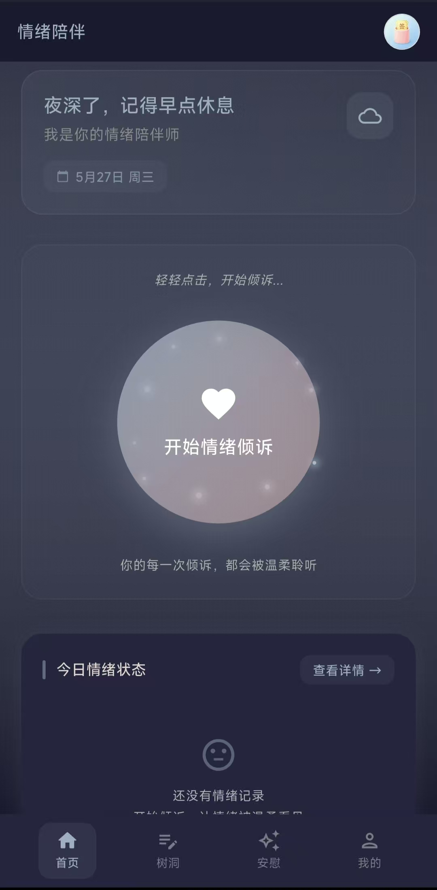</td>
  <td>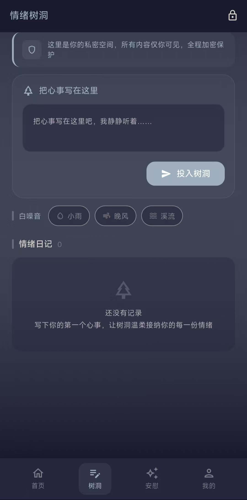</td>
</tr>
<tr>
  <td><b>AI 暖心安慰</b> — 流式对话、语音朗读、对话历史管理</td>
  <td><b>AI 梦境解读</b> — 五维度深度解析、历史记录</td>
</tr>
<tr>
  <td>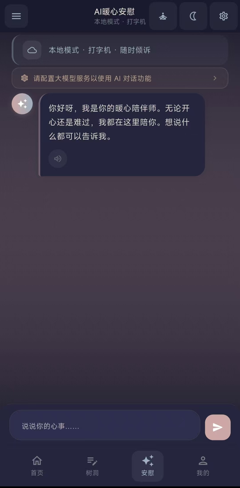</td>
  <td>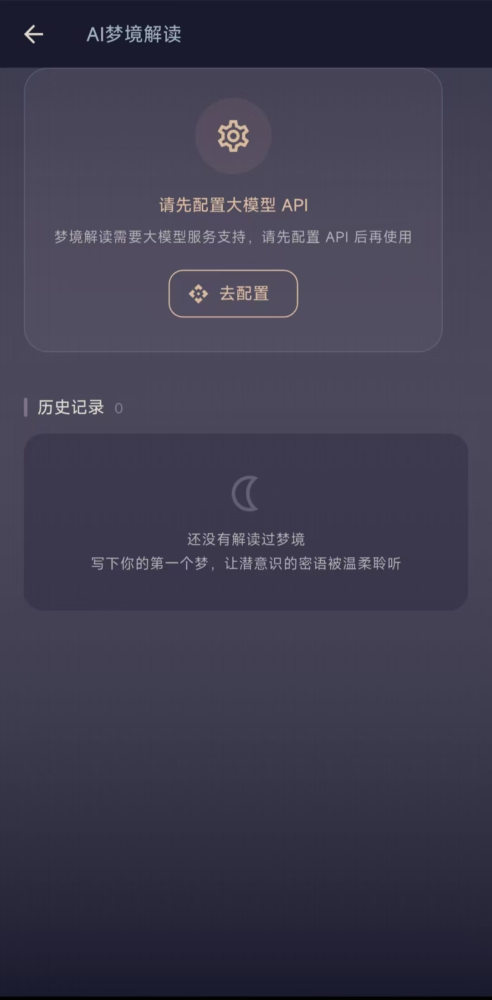</td>
</tr>
<tr>
  <td><b>情绪分析报告</b> — 七维雷达图、AI 解读、舒缓建议、趋势</td>
  <td><b>隐私中心</b> — 密码管理、夜间模式、数据清空</td>
</tr>
<tr>
  <td></td>
  <td>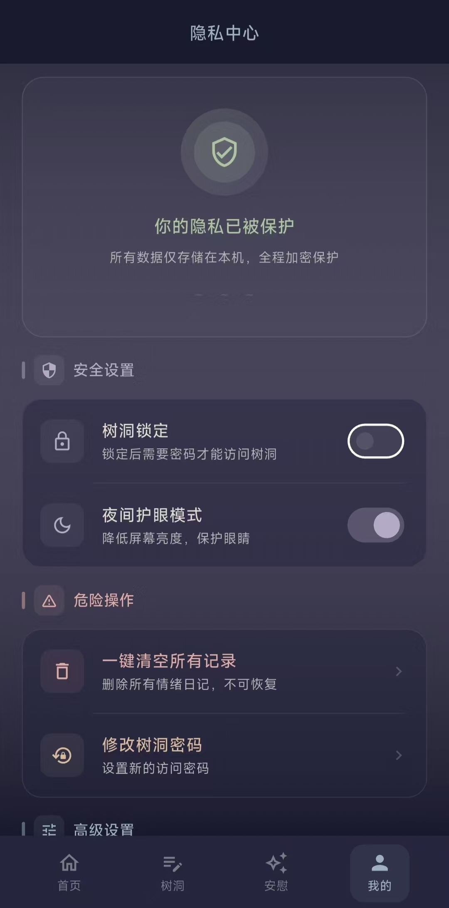</td>
</tr>
<tr>
  <td><b>API 配置</b> — 大模型 + 语音合成双引擎、连接测试</td>
</tr>
<tr>
  <td>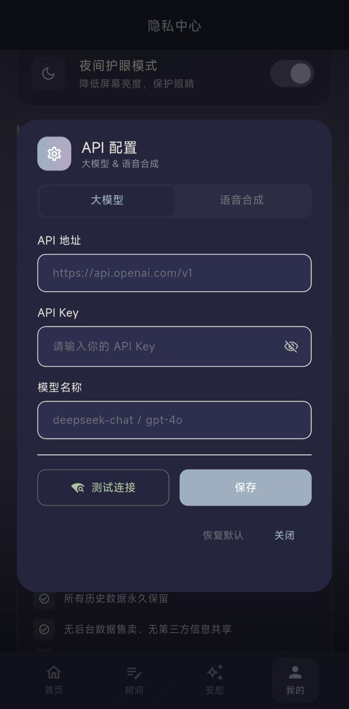</td>
</tr>
</table>

### 桌面端

> 自动检测屏幕宽度，≥900px 切换为桌面布局：左侧导航侧边栏 + 内容居中约束（最大 1200px）
>
> 截图存放于 `assets/screenshots/desktop/`

<table>
<tr>
  <td width="50%"><b>首页</b> — 左侧导航栏、内容居中、宽屏卡片布局</td>
  <td width="50%"><b>情绪树洞</b> — 居中单列、白噪音切换、密码锁定</td>
</tr>
<tr>
  <td>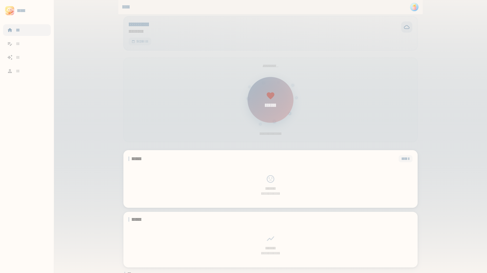</td>
  <td>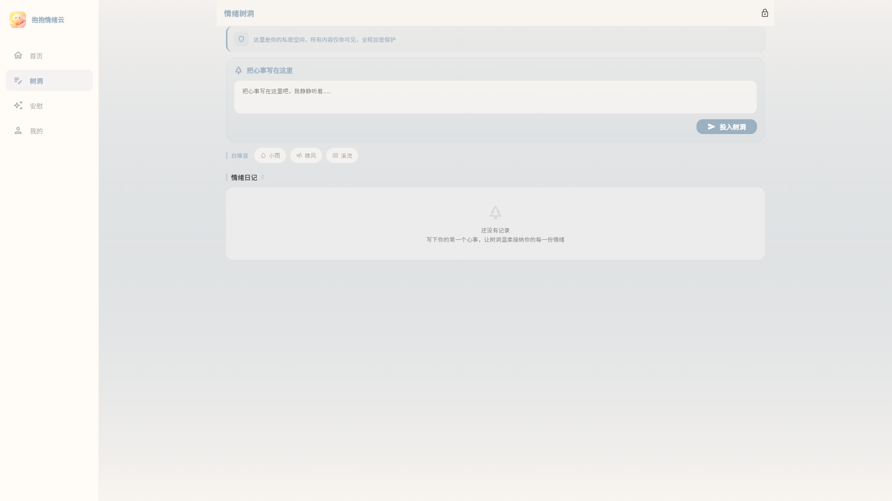</td>
</tr>
<tr>
  <td><b>AI 暖心安慰</b> — 对话列表面板可收起、聊天区自适应</td>
  <td><b>AI 暖心安慰 · 面板展开</b> — 点击菜单按钮展开对话记录侧边面板</td>
</tr>
<tr>
  <td>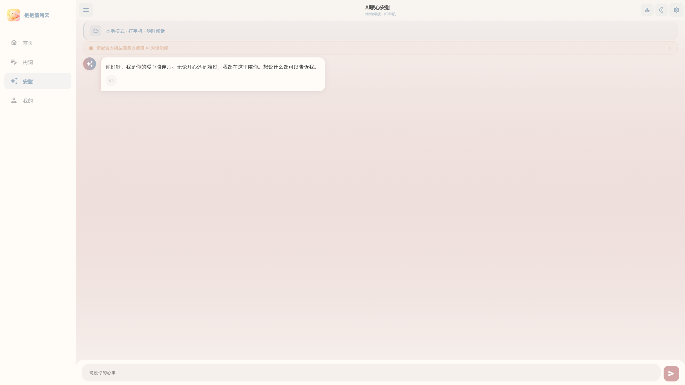</td>
  <td>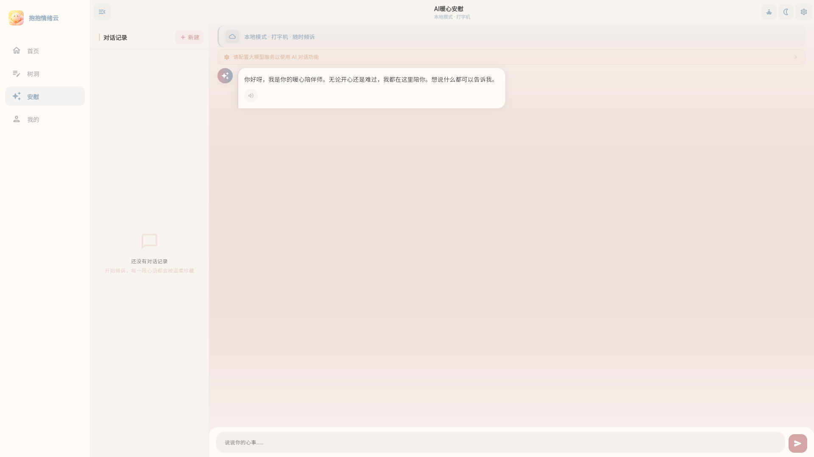</td>
</tr>
<tr>
  <td><b>AI 梦境解读</b> — 全屏页面、内容居中 1200px</td>
  <td><b>情绪分析报告</b> — 七维雷达图、趋势图表、宽屏优化</td>
</tr>
<tr>
  <td>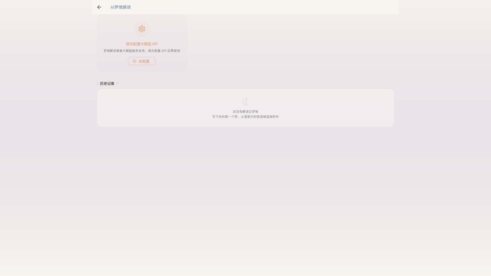</td>
  <td>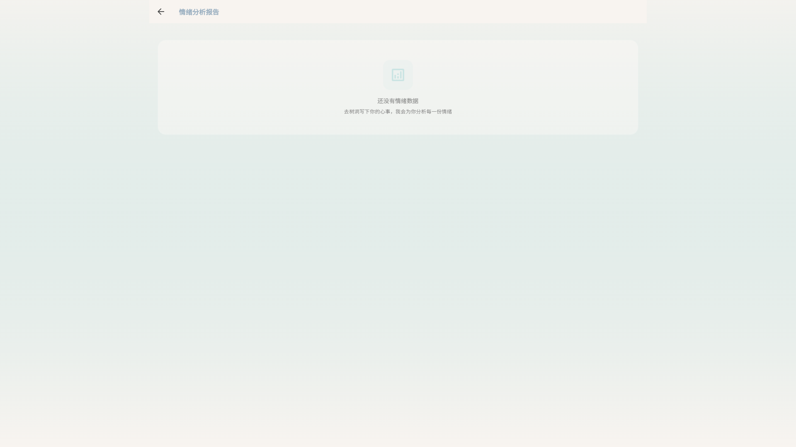</td>
</tr>
<tr>
  <td><b>隐私中心</b> — 设置项居中、卡片式布局</td>
  <td><b>API 配置</b> — 大模型 + 语音合成双引擎</td>
</tr>
<tr>
  <td>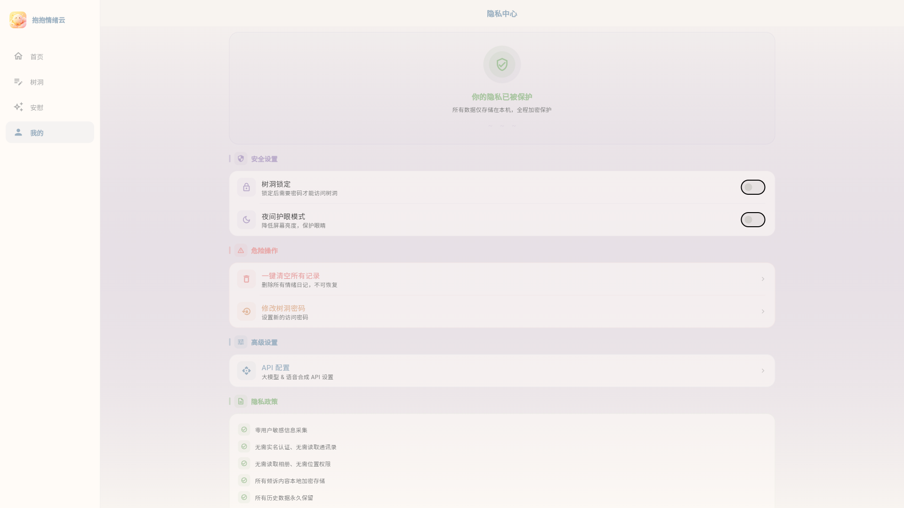</td>
  <td>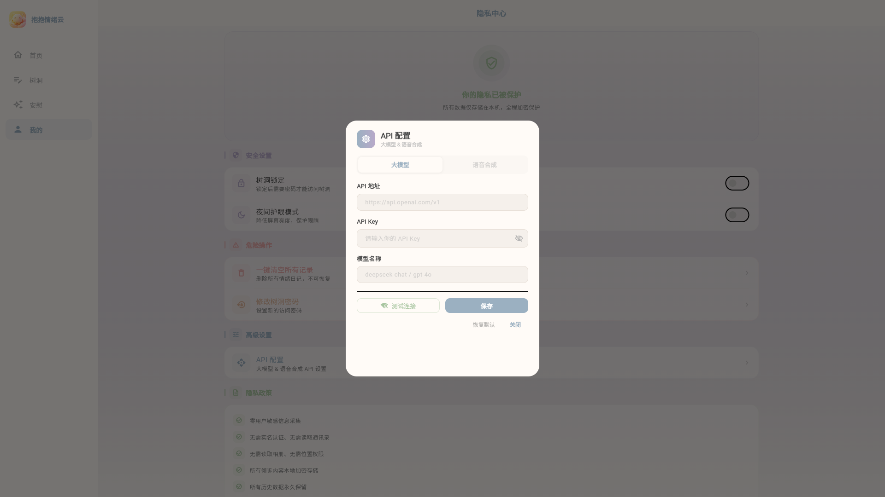</td>
</tr>
</table>

## 技术栈

| 层级 | 技术 |
|------|------|
| 框架 | Flutter 3.38.5 |
| 语言 | Dart（SDK ^3.10.4） |
| UI | Material 3 + 莫兰迪低饱和度配色 + 明暗双主题 + 响应式桌面端适配 |
| 状态管理 | GetX + GlobalKey（跨页同步） |
| HTTP | http ^1.6.0（OpenAI 兼容格式 API） |
| 本地存储 | Hive + SharedPreferences + MD5 密码加密 |
| 系统 TTS | flutter_tts ^4.2.5（Android/iOS/Windows/macOS/Web） |
| 图表 | CustomPaint 情绪雷达图 |
| Markdown | flutter_markdown ^0.7.4 |
| 音频 | audioplayers ^6.1.0（白噪音 + API TTS 播放） |
| 字体 | google_fonts ^6.2.1 |
| SVG | flutter_svg ^2.0.10 |
| 工具 | intl ^0.19.0 · crypto ^3.0.6 |
| 情感分析 | 本地关键词权重 + 大模型深度分析 |
| 梦境分析 | 大模型多维度梦境解读 |

## 项目结构

```
lib/
├── main.dart                           # 入口 + 响应式导航（桌面端侧边栏 / 移动端底部导航） + 首次启动配置检查
├── app/
│   ├── config/
│   │   ├── llm_config.dart             # 大模型 API 配置（空默认值，通过应用内配置）
│   │   └── speech_config.dart          # TTS 配置（双引擎：系统默认 + 自定义 API）
│   ├── routes/app_routes.dart          # 路由
│   ├── themes/
│   │   ├── app_colors.dart             # 莫兰迪配色定义（含暗色令牌）
│   │   └── app_theme.dart              # 明/暗双主题
│   ├── responsive/
│   │   ├── responsive_utils.dart       # 响应式断点工具（≥900px 桌面端）
│   │   ├── desktop_sidebar.dart        # 桌面端左侧导航侧边栏
│   │   └── adaptive_content_wrapper.dart # 自适应内容居中包装器
│   └── app_controller.dart             # GetX 全局状态（主题切换、桌面图标）
├── pages/
│   ├── home/home_page.dart             # 首页
│   ├── treehole/treehole_page.dart     # 情绪树洞
│   ├── comfort/comfort_page.dart       # AI 暖心安慰（流式对话 + 语音朗读）
│   ├── analysis/analysis_page.dart     # 情绪分析报告
│   ├── dream/dream_page.dart           # AI 梦境解读
│   └── privacy/privacy_page.dart       # 隐私中心
├── widgets/
│   ├── unified_config_dialog.dart      # 统一 API 配置弹窗（大模型 + TTS 双标签页）
│   ├── speech_params_dialog.dart       # 语音参数弹窗（语速/音量/音调）
│   ├── emotion_radar.dart              # 情绪雷达图（CustomPaint）
│   ├── heartbeat_breath_button.dart    # 呼吸粒子动画按钮
│   ├── fortune_draw.dart               # 每日抽签
│   ├── fortune_calendar.dart           # 签到日历
│   └── app_splash.dart                 # 启动闪屏动画
├── services/
│   ├── llm_service.dart                # 大模型 API（对话/流式/情绪分析/梦境解读）
│   ├── emotion_service.dart            # 本地情感分析
│   ├── ai_comfort_service.dart         # 本地预设安慰话术（降级备选）
│   ├── speech_service.dart             # 语音服务（系统 TTS + 火山方舟 API TTS）
│   ├── storage_service.dart            # 本地存储（Hive 多 Box）
│   ├── hive_adapters.dart              # Hive 类型适配器注册
│   └── icon_service.dart               # Android 动态图标切换
└── models/
    └── emotion_models.dart             # 数据模型
```

## 快速开始

### 1. 环境要求

- Flutter SDK 3.38.5+
- Dart SDK 3.10.4+

### 2. 克隆项目

```bash
git clone <repo-url>
cd Emotion_Companion_Assistant
flutter pub get
```

### 3. 运行

```bash
# Windows
flutter run -d windows

# macOS
flutter run -d macos

# Chrome
flutter run -d chrome

# Android
flutter run -d android
```

### 4. 配置大模型 API（可选，推荐）

首次启动应用时会弹出配置对话框，你也可以随时在「我的 → API 配置」中设置：

- **大模型**：填写 OpenAI 兼容格式的 API 地址、Key 和模型名称
  - 支持 DeepSeek、OpenAI、Qwen、GLM 等所有兼容接口
  - 未配置时自动使用本地预设话术
  - 点击「测试连接」验证配置是否正确

### 5. 语音朗读

- **系统默认**（推荐）：使用设备自带 TTS 引擎，无需任何配置，开箱即用
  - 可在「语音参数」中调节语速、音量、音调
  - 可在「音色选择」中切换系统已安装的语音
- **自定义 API**：在 API 配置弹窗的「语音合成」标签页切换至自定义 API 模式
  - 支持火山方舟/豆包语音合成 2.0
  - 需自行提供 API 地址和 Access Token

### 6. 打包

```bash
# Windows
flutter build windows

# macOS
flutter build macos

# Android
flutter build apk --release
```

## 配置说明

- **API 密钥不会提交到 Git**：配置文件默认值为空，实际密钥通过应用内对话框填写后存储在本地 Hive 数据库中
- **配置项**：API 地址、API Key、模型名称均通过 UI 配置并持久化到本地，不同步到云端
- **语音引擎切换**：系统默认 ↔ 自定义 API 可在同一配置界面中随时切换

## 许可证

MIT
